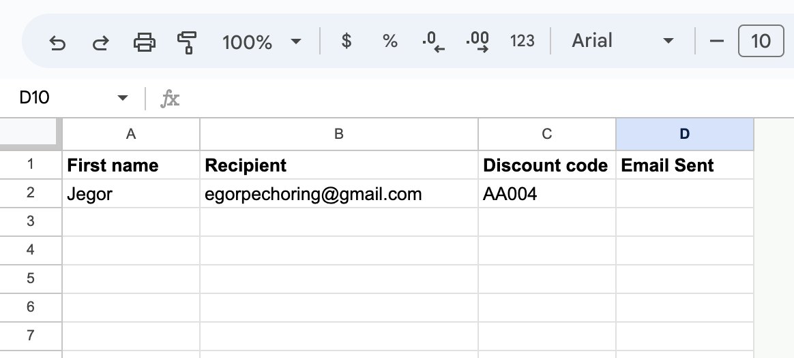
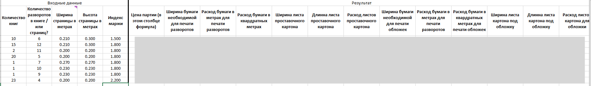

# spreadsheet-scripts-freelance

I use my coding skills to solve real business issues in will to improve key business processes.
This repository demonstrate some of excel and google sheets scripts I developed, all presented scripts in use.

* [Emails sending automatisation Google Sheets script](#emails-sending-automatisation-google-sheets-script)
* [Price calculation process Excel automatisation for local printing company](#price-calculation-process-excel-automatisation-for-local-printing-company)
* [Nesting process Excel automatisation for Fortaco Estonia](#nesting-process-excel-automatisation-for-fortaco-estonia)

More my working experience could be found on [LinkedIn page](https://www.linkedin.com/in/jegor-petsorin/).

## Emails sending automatisation Google Sheets script

I developed a custom Google Sheets script for email automation, allowing seamless delivery of personalized emails through Gmail, optimizing time and resources during my time as a mentor at ENSKIED.

- Table takes variables for inserting it into template (which saved in drafts)

- New menu item exists in menu row

- On click it displays functions, which is only one

## Price calculation process Excel automatisation for local printing company

Excel VBA script transforms local printing company's price calculation, accelerating efficiency and precision while eliminating errors. Developed a robust VBA script incorporating 4 input parameters and generating a comprehensive table of prices and 12 critical business variables. The integration of constants ensures adaptability for diverse tools and materials, resulting in significant time savings and enhanced operational accuracy.

- On the left side of screenshot table take range of input data, such as number of books, number of spreads, page width, page height, margin.
- On the right side custom Excel VBA function writes values for batch price, spread paper width and consumption in meters and square meters, length width and spacer cardboard consumption, etc.

- Script supports different setting placed in hidden worksheet.

## Nesting process Excel automatisation for Fortaco Estonia

Excel VBA script optimizes pipe nesting for Fortaco Estonia, minimizing waste and speeding manufacturing process. Developed a VBA script that transforms manual nesting preparation into an automated task, generating optimized combinations of pipe sizes from input data. 

The script's implementation has resulted in substantial reductions in material waste, time savings, and relieved employees from laborious manual work.

- Instead of solving combination task, employee simply fills yellow fields and receives the optimal combinations.

-Output could be viewed or printed in more friendly way.

